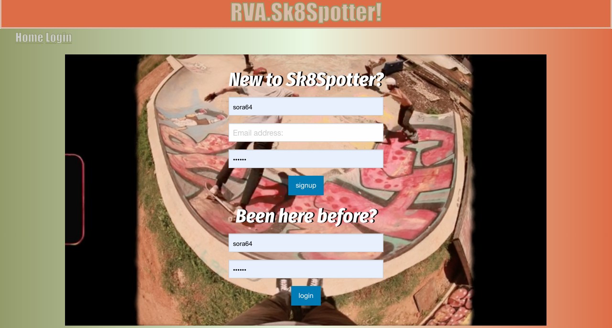

# sk8spotter

## Description

The app will make finding local skateparks easier for skaters. Users can view skateparks in RVA along with images of each skatepark. The app will make it possible for users to leave comments that persist for others in the skateboarding community and will allow them to find new or undiscovered skateparks. In the future, users will be able to add images that persist for each skatepark. We’re hoping this website can be an online community hub for local skateboarders.

## Table of Contents

- [Installation](#installation)
- [Usage](#usage)
- [Contributing](#contributing)
- [Deployed-URL](#deployed-url)
- [Screenshot](#screenshot)
- [Questions](#questions)

## Installation

After cloning the GitHub repository, make sure to run "npm i" to install the required node module packages. Then open up a MySQL shell and run "source db/schema.sql" to create the database. Next, run "npm run seed" to seed that database. Finally, run "npm start" to begin the application. You may also visit the application at its deployed URL on Heroku.

## Usage

This app is a community hub for connecting skateboarders in the Richmond, VA area.

## Contributing

If you have experience with making user-uploaded images persistent within a database and would like to contribute, please contact us!

## Deployed-URL

[Sk8Spotter](https://sk8spotter.herokuapp.com/)

## Screenshot

## Questions

- GitHub: [sora64](https://github.com/sora64/) | [whosshazo](https://github.com/whosshazo) | [Tthompson8416](https://github.com/Tthompson8416) | [cldunham](https://github.com/cldunham)

- Email: If you have any other questions, please reach us at [phelpsa64@gmail.com](mailto:phelpsa64@gmail.com), [ryandeshazo1@gmail.com](mailto:ryandeshazo1@gmail.com), [tthompson8416@outlook.com](mailto:tthompson8416@outlook.com), or [cindydunham4@gmail.com](mailto:cindydunham4@gmail.com).
